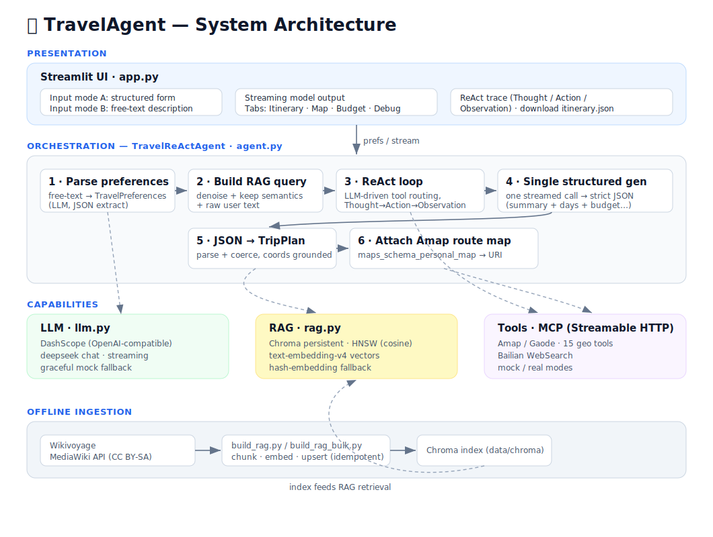
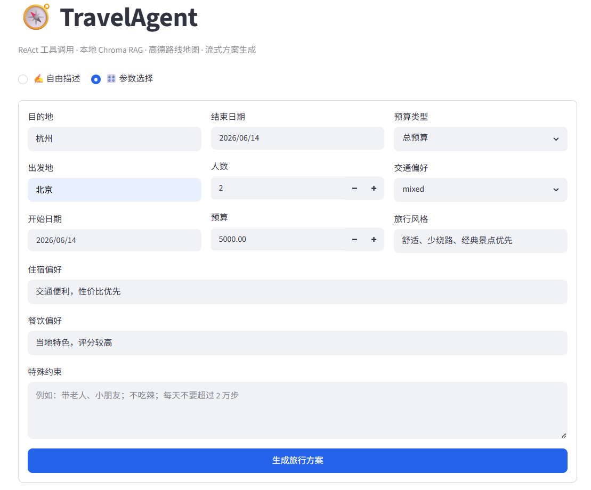
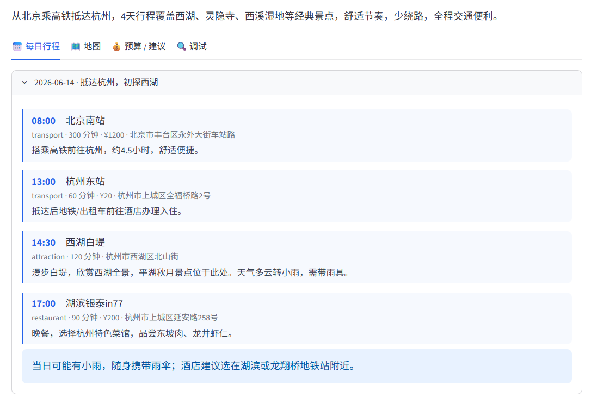
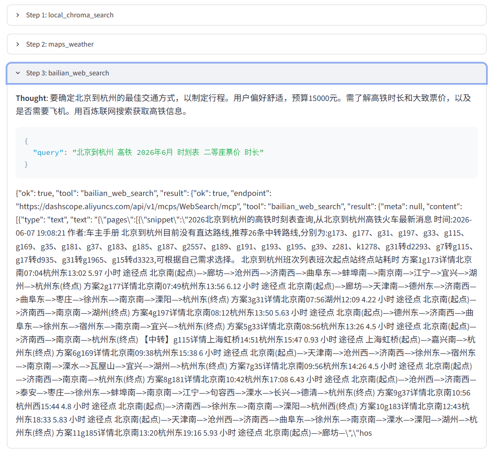

# TravelAgent

Streamlit prototype for a travel-planning ReAct Agent with local Chroma/HNSW RAG.

## Architecture

A ReAct agent orchestrates LLM-driven tool routing, local retrieval, and a single
structured generation that streams strict JSON into the UI. Coordinates are grounded
to tool observations, then turned into an Amap per-day route map. A separate offline
pipeline ingests Wikivoyage into the Chroma index.

## Run

conda activate travelagent
streamlit run app.py

Or:

conda run -n travelagent streamlit run app.py

## Environment

Copy .env.example to .env and set:

- DASHSCOPE_API_KEY
- DASHSCOPE_MODEL=deepseek-v4-pro
- EMBEDDING_MODEL=text-embedding-v4

## Showcase

Enter trip preferences — both a structured form and a free-text description mode are supported:

The model produces a structured plan in a single pass, showing each day's time, place, type,
duration, estimated cost, and reasoning:

The Debug tab exposes the full ReAct trace — every step's Thought, tool call, and Observation,
including the route-map link returned by Amap's `maps_schema_personal_map`:

## Build RAG From Web

The script uses LangChain WebBaseLoader to download public travel pages, splits them, embeds them with DashScope text-embedding-v4, and writes them to Chroma. Chroma persists the HNSW index under data/chroma.

Default sources include Wikivoyage pages for Hangzhou, Shanghai, Beijing, and Suzhou.

Run:

conda run -n travelagent python scripts\build_rag.py --reset

Add your own pages:

conda run -n travelagent python scripts\build_rag.py --reset --url https://en.wikivoyage.org/wiki/Hangzhou

Downloaded raw text is saved under data/downloads.

## MCP

MCP tools support two modes:

- MCP_MODE=mock: local placeholder responses.
- MCP_MODE=real: call Bailian Streamable HTTP MCP endpoints through the MCP Python SDK.

WebSearch is configured by default:

MCP_WEB_SEARCH_ENDPOINT=https://dashscope.aliyuncs.com/api/v1/mcps/WebSearch/mcp

For Amap/Gaode tools, copy the Streamable HTTP Endpoint from the Bailian MCP market into:

MCP_AMAP_ENDPOINT=

Authentication uses:

MCP_AUTH_HEADER=Authorization
MCP_AUTH_SCHEME=Bearer

You can list tools from an endpoint:

conda run -n travelagent python scripts\list_mcp_tools.py

On Windows terminals, set UTF-8 if printing raw MCP search results:

$env:PYTHONIOENCODING="utf-8"
